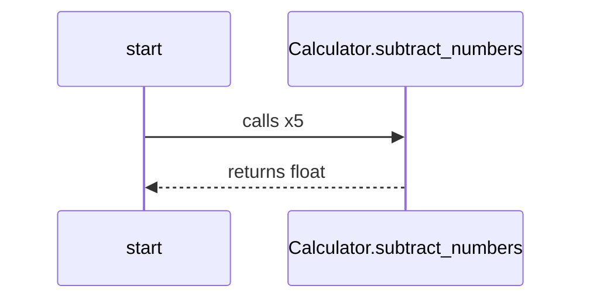

This is a mermaid diagram, you may need to install a [Browser Plugin](https://github.com/BackMarket/github-mermaid-extension) or [VsCode extension](https://marketplace.visualstudio.com/items?itemName=bierner.markdown-mermaid) or similar to view it.

You can also [view it full screen as an SVG](https://mermaid.ink/svg/c2VxdWVuY2VEaWFncmFtCiAgc3RhcnQtPj5DYWxjdWxhdG9yLnN1YnRyYWN0X251bWJlcnM6IGNhbGxzIHg1CiAgQ2FsY3VsYXRvci5zdWJ0cmFjdF9udW1iZXJzLS0+PnN0YXJ0OiByZXR1cm5zIGZsb2F0Cg==)        

